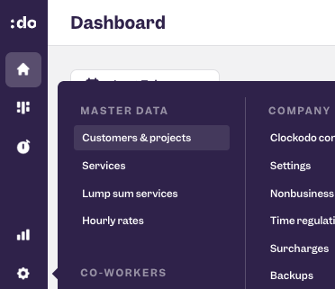
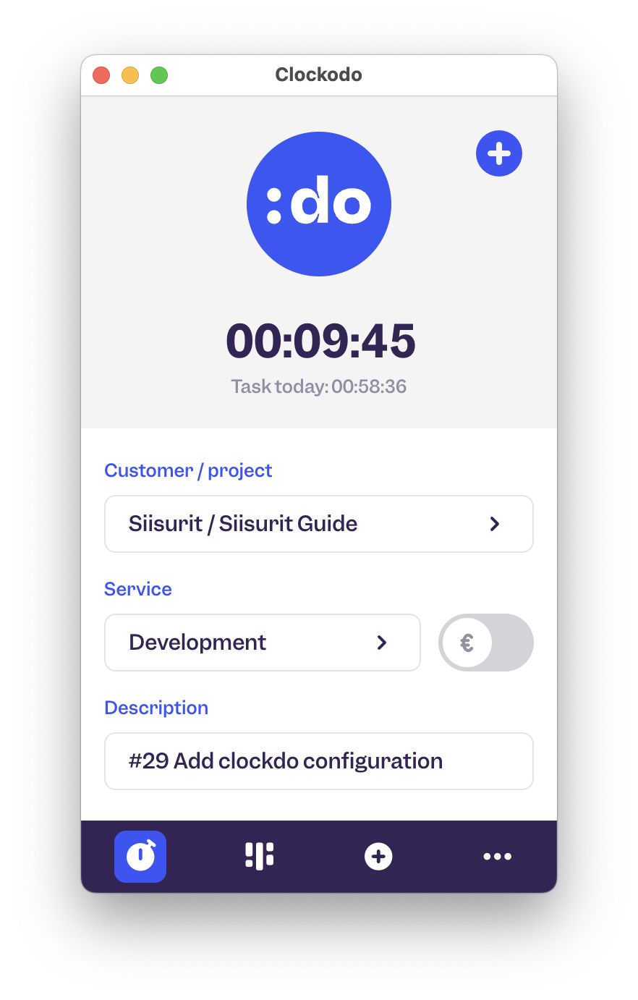

# Clockodo

[Clockodo](https://www.clockodo.com/) is a time tracker that can track projects for different customers. It includes billing and reporting. In addition to the web-based user interface, is also offers a mobile app then can be used off-line.

## Project URLs

To get the project URL for Siisurit, perform the following steps:

1. Sign in at <https://www.clockodo.com/>.
2. Navigate to the dashboard.
3. In the sidebar, navigate to Settings > Master data > Customers & projects.<br>
   
4. In the customer list, search or select the customer with the project you want to connect to.
5. In the project list, select the project you want to connect to.
6. Copy the URL from the web browser's URL bar. It should look something like this: `https://my.clockodo.com/en/projectreports/report/?id=123` but with a different number at the end.

## API user and token

For authentication, the Clockodo API needs the email and API token of a user.

The API token will then have the same **permission** as its user. Pure read access is enough. So make sure your user can access all the projects you want to connect to.

To get an API token for Siisurit, perform the following steps.

1. Sign in at <https://www.clockodo.com/>.
2. Navigate to <https://my.clockodo.com/en/users/editself/> or alternatively, tap your profile icon in the top right and choose "Personal data" from the menu.
3. In the section "Personal data", the "E-mail address" can be seen. For example: `someone@example.com`.
4. In the section "API key", generate an API key. A typical example looks like: `abcdef01234567890123456789abcdef`.

## Example configuration

Using the example values from above and the `api_kind` of `clockodo`, a tracker configuration for Clockodo could look like:

```yaml
trackers:
  - name: example-clockodo
    api_kind: clockodo
    api_location: "https://my.clockodo.com/en/projectreports/report/?id=123"
    api_token: "abcdef01234567890123456789abcdef"
    api_username: "someone@example.com"
    user_mapping: "..." # Set as needed.
```

## Breadcrumb trail and text

The breadcrumb trail in Siisurit is of the form `customer / project / service`.

The text is Siisurit is the description.

As an example, consider the following work entry in the Clockodo app, which results in:

- Breadcrumb trail: `Siisurit / Siisurit Guide / Development`
- Text: `#29 Add clockdo configuration`


