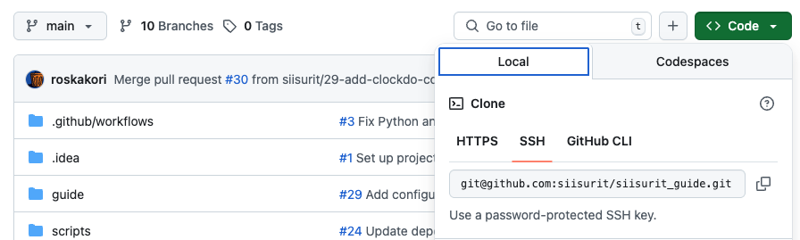

# GitHub

[GitHub](https://github.com) is a cloud-based development platform that includes a task tracker.

## Terminology

For consistency, this chapter uses _task_ to refer to GitHub _issues_ and _tracker_ to refer to a _repository_.

## Tracker URLs

To get the tracker URL for Siisurit, perform the following steps:

1. Open the tracker's GitHub page in the web browser.
2. Click on the green "Code" button and in the "Local" tab, copy the URL. Both HTTPS or SSH URLs work.<br>
   

Example tracker URLs:

- `https://github.com/someone/anything.git`
- `git@github.com:someone/anything.git`

## API user and token

Follow the steps described at "[Create personal GitHub API access token (classic)](https://docs.github.com/en/authentication/keeping-your-account-and-data-secure/creating-a-personal-access-token#creating-a-personal-access-token-classic)". When asked to specify the permissions, enable the following:

- repo
- read:user
- read:project

Siisurit does not need to access the source code repository, but the `repo` permission is still needed to extract tasks.

## Matching tasks

Tasks always have a code that starts with a number sign (`#`) followed by one or more digits. For example: `#123`. Work entries can refer to such a task by mentioning its code in the text. The regular expression to extract the task code always looks like this:

```regexp
(?P<task_code>#\\d+)
```

Notice the double backslash (`\\`) to resolve into a single backslash for `\d` in order to match "any decimal digit".

## Example configuration

This configuration used the example values from above and connects as user `someone` to a project `anything`.

The text pattern

```yaml
text_pattern: "^(?P<task_code>#\\d+).*"
```

matches all texts that start with a GitHub task code.

If you want to match the task code anywhere in the text of the work entry, use:

```yaml
text_pattern: ".*(?P<task_code>#\\d+).*"
```

Typically, a single work match of type `pattern_to_task_code` is enough to match all work entries with a text like `#123 Do something` to their corresponding task.

To also collect any work entries referring to non-existent tasks, it is recommended to have a manuel task titled "Various" and a code "various" (or something similar). Then, by using a work match of type `always` and a low `priority`, anything else will be collected there.

Here is an example putting all this together:

```yaml
trackers:
  - name: example-github
    api_kind: github
    api_location: "git@github.com:someone/anything.git"
    api_token: "ghp_abcd1234JLKM..."
    api_username: "someone"
    user_mapping: "..." # As needed
    tasks:
      - title: Various
        code: various
    work_matches:
      - match_on: pattern_to_task_code # Match to GitHub task
        source_work_trackers: example-work-tracker
        priority: 100
        text_pattern: "^(?P<task_code>#\\d+).*"
      - match_on: always # Match anything else
        source_work_trackers: example-work-tracker
        target_task: various
        priority: 1
```
