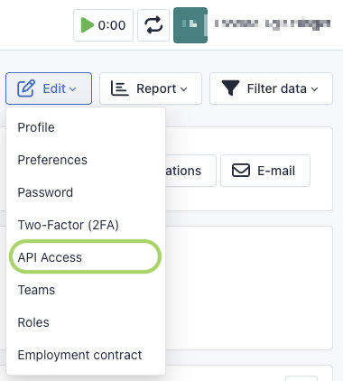
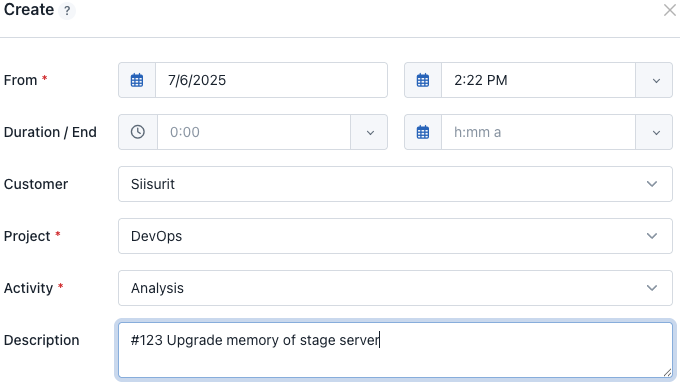

# Kimai

[Kimai](https://www.kimai.org/) is an open source work tracker that can track both time and budget. It includes standard reports to keep evaluate and keep track of your projects. It also provides [plugins](https://www.kimai.org/store/), for example, to check compliance with legal working hours of certain regions. Plugins can have a commercial license.

!!! note "Task management plugin"

    Kimai also has an optional [task management plugin](https://www.kimai.org/store/task-management-bundle.html) that can add an internal task tracker. Siisurit does not yet map these tasks to Siisurit tasks.

## Terminology

For consistency, this chapter uses _work tracking_ to refer to Kimai _time tracking_, except when referring to specific user interface elements in Kimai.

## API location

To get the API location for Siisurit, perform the following steps:

1. In the sidebar, select Administration > Projects.
2. In the project list, select the desired project.
3. On the project screen, copy the URL from the web browser's URL bar. For example: `https://kimai.example.com/en/admin/project/123/details`.

Alternatively, you can also choose Administration > Customers, then select a customer and use their URL. For example, `https://kimai.example.com/en/admin/customer/234/details`. With such a URL, all Kimai work entries of this customer are transferred into a single Siisurit tracker.

## API token

To get a Kimai API token for Siisurit, perform the following steps.

1. Sign in to your Kimai server.
2. Click your name in the top right.
3. In the resulting menu, select "My profile".
4. On the profile page, click "Edit".
5. In the resulting menu, select "API Access".<br>
   
6. On the resulting page, click on "Create" to create a new API token.

A token, for example, might look like: `1234567890abcdef123456789`

## Breadcrumb trail and text

As an example, consider the following work entry in the Kimai:



The breadcrumb trail in Siisurit is of the form `customer / project / activity`. For this example: `Siisurit / DevOps / Analysis`

The text in Siisurit is the description. For this example: `#123 Upgrade memory of stage server`

## Example YAML

Here is an example of a Kima tracker in the configuration YAML:

```yaml
trackers:
  - name: demo-kimai
    api_kind: kimai
    api_location: "https://kimai.example.com/en/admin/project/123/details"
    api_token: "1234567890abcdef123456789"
    user_mapping: "..." # As needed
```
