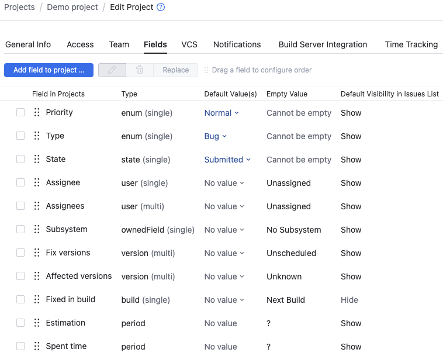
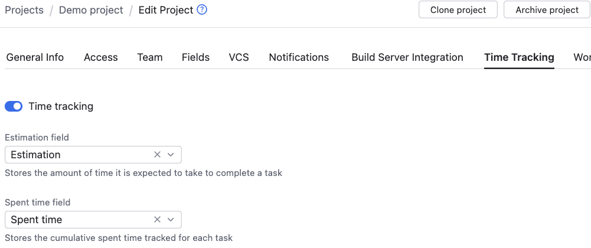

# YouTrack

[YouTrack](https://www.jetbrains.com/youtrack/) is a proprietary software for project management, which includes both a task tracker and an optional, integrated work tracker.

## Terminology

For consistency, this chapter uses _task_ to refer to YouTrack _issues_ and _work tracking_ to refer to YouTrack _time tracking_, except when referring to specific user interface elements or custom field names in YouTrack.

## Tracker URL

Unlike many other trackers, YouTrack does not easily reveal the tracker ID in a URL. Instead, perform the following steps:

1. Open the YouTrack project list, for example: `https://example.youtrack.cloud/projects`
2. In the project list, click on the project you want Siisurit to connect to.
3. In the project screen, click "New Issue".
4. In the "New issue" screen, navigate to the URL bar and copy the URL to your clipboard.

This URL is the `api_location` in the YAML configuration (see below). It should look something like: `https://example.youtrack.cloud/newIssue?project=DEMO&draftId=1-23`

From this, Siisurit can extract the base URL `https://example.youtrack.cloud/` and the project shortname `DEMO`, which is also used as prefix for tasks, for example: `DEMO-123`.

## API token

To create an API token, follow the instruction in the YouTrack documentation chapter on "[Manage Permanent Tokens](https://www.jetbrains.com/help/youtrack/devportal/Manage-Permanent-Token.html)". When asked for the **scope**, choose "YouTrack" and "YouTrack Administration" scope. The latter is needed to read the settings for [YouTrack time tracking](#work-tracking-and-estimates).

If you are logged in, and you don't see the option to create a token, ask an administrator to grant your account the **Read Service permission**.

## Custom fields

In YouTrack, tasks have a flexible structure and use [custom fields](https://www.jetbrains.com/help/youtrack/server/custom-fields.html) to represent different concepts. In other trackers, these are often standard fields with a fixed name and type.

Siisurit provides ways to access this information using additional configuration options, special logic based on the [custom field type](https://www.jetbrains.com/help/youtrack/server/supported-custom-field-types.html), and YouTrack server settings.

For example, consider the following custom fields for a project:



Most of them are standard fields. "Assignee" and "Assignees" are examples to be mapped to the Siisurit's [assignees](#assignees). "Estimation" and "Spent time" can be mapped to Siisurit's [work tracking and estimates](#work-tracking-and-estimates).

### Assignees

By default, Siisurit takes the first custom field of type `user` as assignee. If this field has multiple values, it results in multiple assignees. For simple tracker configurations, this might already be what you want.

However, some tracker configurations have multiple `user` fields. For example, to represent different roles like "requirement engineer", "designer", "developer", "tester", "translator", and so on. In this case, you might either choose to treat a specific field or multiple of them as "assignee" in Siisurit.

In the configuration YAML, use the tracker option `api_custom_assignee_fields` to specify these fields by name. Be aware these names are **case-sensitive**. For example, to extract the assignee from a single custom field named "Assignee" of type `user`:

```yaml
api_custom_assignee_fields: "Assignee"
```

To combine multiple fields, use a comma-separated list of fields. For example:

```yaml
api_custom_assignee_fields: "Owner, Developer, Tester, Translator"
```

## Work tracking and estimates

!!! warning "Missing support for work tracking"

    While YouTrack can be used as a work tracker, Siisurit currently only support transferring estimates but not work entries. This might change once there is a customer who actually needs this.

YouTrack first and formost is a task tracker. However, it includes an optional work tracker that enables to track time for tasks.

To enable work tracking in YouTrack, follow the instructions given in the chapter "[Projects / Enable Time Tracking](https://www.jetbrains.com/help/youtrack/cloud/enable-and-configure-time-tracking.html)". Eventually, your project settings in the "Time tracking" tab should look similar to this:



During transfer, Siisurit will check this configuration and, if enabled and set, extract the custom field "Estimation".

It is possible to have only "Estimation" and transfer work entries from an external time tracker. You still have to enable work tracking in YouTrack, but can never actually book any time on any task.

## Work matching

Example regular expression to match task codes of a project with the shortname "DEMO", for example, `DEMO-123`:

```regexp
".*(?P<task_code>DEMO-\\d+).*"
```

## Example YAML

Here is an example of using YouTrack as a plain task tracker:

```yaml
trackers:
  - name: demo-youtrack
    api_custom_assignee_fields: "Assignee, Assignees"
    api_kind: youtrack
    api_location: "https://demo.youtrack.cloud/newIssue?project=DEMO&draftId=1-23"
    api_token: "perm:abcd.eFgHiJ==.abcdefghifklmnopqrstuvwxyz1234"

    tasks:
      - title: Various
        code: various
    work_matches:
      - match_on: pattern_to_task_code # Match to GitHub task
        source_work_trackers: demo-youtrack
        priority: 100
        text_pattern: ".*(?P<task_code>DEMO-\\d+).*"
      - match_on: always # Match anything else
        source_work_trackers: demo-youtrack
        target_task: various
        priority: 1
```
