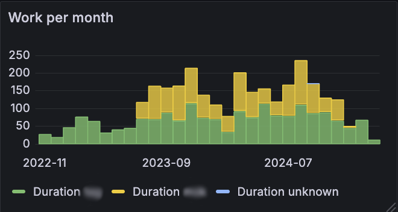

# Adding a Grafana panel

This section outlines how to add a panel for a Grafana dashboard based on one of Siisurit's [report database views](../report-views.md).

This assumes a properly configured [Grafana setup with a Siisurit datasource](../../admin/installation/grafana.md).

The finished panel should look something like this:



## Add a panel

See the chapter on [panels and visualization](https://grafana.com/docs/grafana/latest/panels-visualizations/) in the Grafana documentation.

## Time range

Chose "Last 1 year" or any number of months that make sense for your projects.

## Queries

- Data source: siisurit-postgres
- In Query A: Select "Code" and use the following SQL select:
  ```sql
  select
    date_trunc('month', started_at) as "Month",
    username,
    sum(duration_in_hours) as "Duration"
  from
    report_work
  group by
    1, 2
  order by
    1, 2
  ```

## Transformations

Choose "Partition by value"

- Field: username
- Naming: As label
- Keep fields: Yes

## Visualization

Choose "Bar chart"

## Panel options

Title: Monthly work per member [h]

## Bar chart

- X Axis: Month (base field name)
- X-axis labels minimum spacing: Small
- Show values: Auto
- Stacking: Normal

## Standard options

- Unit: leave empty

!!! note "Unit hack"

    Ideally, the unit would be "Time / hours(h)". Unfortunatelly, Grafana automatically converts larger numbers of hours to 24 hour days, which usually is not what you are interested in.

## Everything else

Keep the defaults or adjust as needed.
